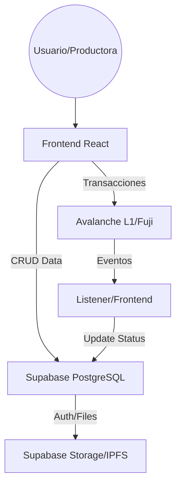

# Arquitectura del Sistema - SContract Artistas Salta

SContract es una plataforma híbrida que combina la inmutabilidad de la blockchain Avalanche con la agilidad de Supabase para la gestión de datos y autenticación.

## Stack Tecnológico

| Capa | Tecnología | Propósito |
| :--- | :--- | :--- |
| **Blockchain** | Avalanche (Fuji Testnet) | Liquidación de pagos, Escrow, Splits fiscales automáticos. |
| **Smart Contracts** | Solidity (0.8.20) | Lógica de negocio descentralizada. |
| **Frontend** | React + Vite + TS | Interfaz de usuario profesional y reactiva. |
| **Estilos** | Tailwind CSS / Vanilla CSS | Diseño premium y responsive. |
| **Backend / DB** | Supabase (PostgreSQL) | Cache de eventos on-chain, perfiles de artistas, gestión de documentos. |
| **Storage** | IPFS (via Supabase/Web3) | Almacenamiento descentralizado de contratos legales firmados. |

## Flujo de Datos

El sistema sigue un modelo de "Single Source of Truth" compartido entre la Blockchain y Supabase:

1.  **Registro**: Los artistas y productoras se registran en la plataforma. Sus datos se guardan en Supabase, asociando su identidad con su dirección de wallet.
2.  **Contratación**: La productora genera un contrato legal (PDF) y lo sube a la plataforma. El hash del documento se guarda en IPFS.
3.  **Fondeo (Escrow)**: La productora deposita los fondos en el Smart Contract `EscrowSplitV2`, referenciando el hash de IPFS.
4.  **Ejecución**: Una vez realizado el show, la productora libera el pago. El Smart Contract realiza el split automático:
    -   **94.2%** al Artista (Neto).
    -   **4.8%** a la Municipalidad (Retención fiscal automática - Sellos + Actividades Económicas).
    -   **1%** a la Productora (Comisión de servicio, si aplica).
5.  **Sincronización**: El frontend escucha los eventos on-chain para actualizar el estado del contrato en la base de datos de Supabase, permitiendo auditoría en tiempo real.

## Diagrama de Componentes (Simplificado)

## Seguridad y Transparencia

-   **Non-Custodial**: La plataforma no custodia los fondos; estos residen en el Smart Contract hasta que se cumplen las condiciones de liberación.
-   **Transparencia Fiscal**: La Municipalidad de Salta (DGR) recibe su parte en tiempo real, eliminando la evasión y el retraso en la liquidación de impuestos.
-   **Auditoría**: Cualquier ciudadano o ente regulador puede verificar la transacción en Snowtrace usando el hash del contrato.
